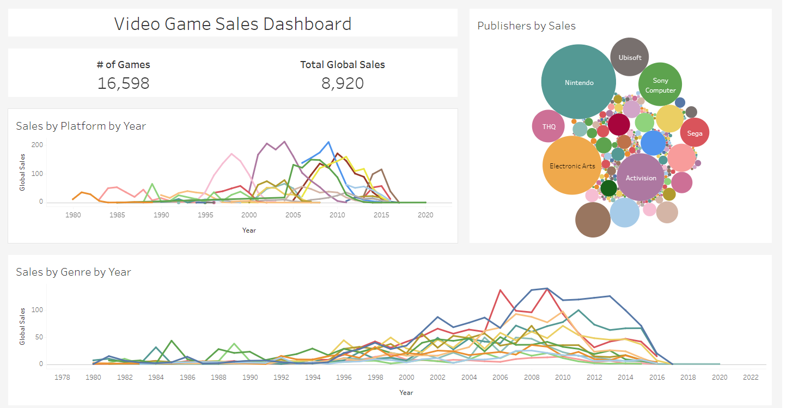

# Video-Game-Sales-Analysis
## Introduction
In this project, I am going to take a look at the Global Video Game Sales dataset from Kaggle.

Link to the dataset here: https://www.kaggle.com/datasets/thedevastator/global-video-game-sales

## Dashboard
)
  Link to the dashboard:   https://public.tableau.com/views/Game_Sales_Dashboard_16958861228720/Game_Sales_Dashboard?:language=en-US&publish=yes&:display_count=n&:origin=viz_share_link
## Findings
**What is the best genre to develop a new game for?**
* Globally, the best genre to develop a new game for would be Action.
* Best genre by region
  * NA: Action
  * EU: Action
  * JP: Role-Playing
* However, another element to consider based on the genre trends are genres that are rising in popularity.
* These genres are either overtaking the best selling genre or are a close second in recent years.
* Genres rising in popularity by region
  * NA: Shooter
  * EU: Shooter
  * JP: Action
* The worst selling genre is Strategy which should be avoided when considering a new game project.
  
**What is the best platform to develop a new game for?**
* Because new platforms are being released all the time, the data concerning platforms is outdated.
* However, there are only 3 main modern platforms which is Playstation, Xbox, and Nintendo platforms.
* Considering the most popular platform in each region in terms of the 3 main modern platforms can tell us the optimal platform for each region
* Best platform by region according to the data
  * NA: Xbox 360
  * EU: PS3
  * JP: DS
* Applying modern popular platforms
  * NA: Xbox One
  * EU: PS5
  * JP: Nintendo Switch
* There isn't necessarily a single worst platform but there is no reason to develop a game for an outdated platform

**What is the best publisher to work with to develop a new game for each genre and overall for each region?**
* Overall in each region, Nintendo is the publisher with the best selling games regardless of region.
* Most profitable publishers per genre per region
  * NA
    * Electronic Arts: Platform, Action, Fighting
    * Nintendo: Role-Playing, Sports, Racing, Simulation, Adventure, Shooter
    * Activision: Misc
    * Take-Two Interactive: Puzzle
    * THQ: Strategy
  * EU
    * Electronic Arts: Platform, Racing, Simulation
    * Activision: Role-Playing, Shooter
    * Nintendo: Misc, Puzzle, Action, Fighting
    * Take-Two Interactive: Sports
    * THQ: Strategy
    * Ubisoft: Adventure
  * JP
    * Nintendo: Role-Playing, Misc, Puzzle, Racing, Simulation, Adventure, Shooter
    * Konami: Sports
    * Bandai Namco: Fighting, Strategy
* Considering the results from genre popularity, the best publishers to work with in each region would be:
  * NA: Electronic Arts and Nintendo
  * EU: Nintendo and Activision
  * JP: Nintendo
